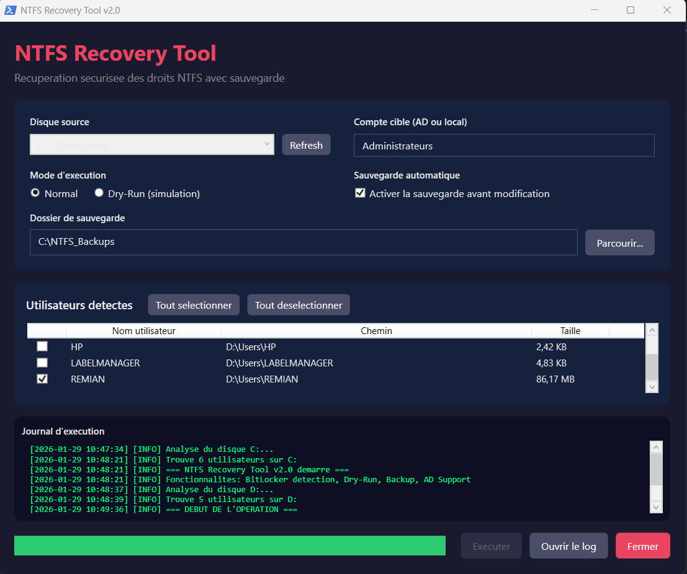

# 🔓 NTFS Recovery Tool

> Outil PowerShell avec interface graphique pour la récupération sécurisée des droits NTFS sur Windows.


## 📋 Fonctionnalités

| Fonctionnalité | Description |
|----------------|-------------|
| 🔐 **Détection BitLocker** | Bloque l'exécution si le disque est chiffré |
| 🧪 **Mode Dry-Run** | Simulation complète sans modification des ACL |
| 📦 **Sauvegarde automatique** | Copie des dossiers prioritaires avant modification |
| 🪪 **Attribution AD** | Droits attribués à un compte AD ou local spécifique |
| 🖥️ **Interface GUI** | Interface graphique WPF moderne (thème sombre) |

## 🎯 Cas d'utilisation

- Récupération de données sur un disque provenant d'un autre PC
- Migration de profils utilisateurs entre domaines AD
- Réparation de droits NTFS corrompus après une réinstallation Windows
- Accès aux dossiers `AppData\Roaming` (Outlook, Chrome, Firefox)

## 📸 Capture d'écran



## 🚀 Installation

### Prérequis

- Windows 10/11 ou Windows Server 2016+
- PowerShell 5.1 ou supérieur
- Droits Administrateur

### Téléchargement

```powershell
# Cloner le dépôt
git clone https://github.com/Frejuste-dev/NFTSRecoveryTool.git
cd NTFSRecoveryTool
```

## 📖 Utilisation

### Lancement

```powershell
# Option 1: Avec bypass de la politique d'exécution
powershell -ExecutionPolicy Bypass -File ".\NTFSRecoveryTool.ps1"

# Option 2: Après avoir modifié la politique
Set-ExecutionPolicy -ExecutionPolicy RemoteSigned -Scope CurrentUser
.\NTFSRecoveryTool.ps1
```

### Workflow recommandé

1. **Sélectionner** le disque source contenant les profils utilisateurs
2. **Vérifier** que BitLocker n'est pas actif (sinon, déverrouiller d'abord)
3. **Cocher** les utilisateurs à traiter
4. **Activer** le mode **Dry-Run** pour un premier test
5. **Définir** le dossier de sauvegarde
6. **Exécuter** et vérifier les logs
7. **Relancer** en mode **Normal** si satisfait

## 📁 Dossiers sauvegardés

Les dossiers suivants sont copiés automatiquement avant modification :

| Dossier | Contenu typique |
|---------|-----------------|
| `Documents` | Fichiers personnels |
| `Desktop` | Bureau |
| `Pictures` | Images |
| `Videos` | Vidéos |
| `Downloads` | Téléchargements |
| `AppData\Roaming` | Profils Outlook, Chrome, Firefox, etc. |

## 📝 Logs

Les logs sont enregistrés dans :
```
C:\Logs\NTFSRecoveryTool.log
```

Format :
```
[2026-01-29 10:45:00] [INFO] === NTFS Recovery Tool v2.0 démarré ===
[2026-01-29 10:45:02] [DRY-RUN] Simulation de prise de possession
[2026-01-29 10:45:03] [SUCCESS] Droits attribués à Administrateurs
```

## ⚠️ Avertissements

> **IMPORTANT** : Ce script modifie les ACL NTFS de manière **permanente** en mode Normal.
> 
> - Utilisez **toujours** le mode Dry-Run pour tester d'abord
> - Activez la **sauvegarde automatique** avant toute modification
> - Les modifications ACL sont **irréversibles** sans backup

## 🔧 Configuration avancée

### Modifier les dossiers prioritaires

Éditez la variable `$script:PriorityFolders` dans le script :

```powershell
$script:PriorityFolders = @(
    "Documents",
    "Desktop",
    "Pictures",
    "Videos",
    "Downloads",
    "AppData\Roaming",
    "AppData\Local\Google\Chrome"  # Ajout personnalisé
)
```

## 🤝 Contribution

Les contributions sont les bienvenues ! N'hésitez pas à :

1. Fork le projet
2. Créer une branche (`git checkout -b feature/amelioration`)
3. Commit vos changements (`git commit -m 'Ajout de fonctionnalité'`)
4. Push sur la branche (`git push origin feature/amelioration`)
5. Ouvrir une Pull Request

## 📄 Licence

Ce projet est sous licence MIT. Voir le fichier [LICENSE](LICENSE) pour plus de détails.

## 👤 Auteur

**Frejuste Dev - Kei Prince Frejuste**

---

⭐ Si ce projet vous est utile, n'hésitez pas à lui donner une étoile !
